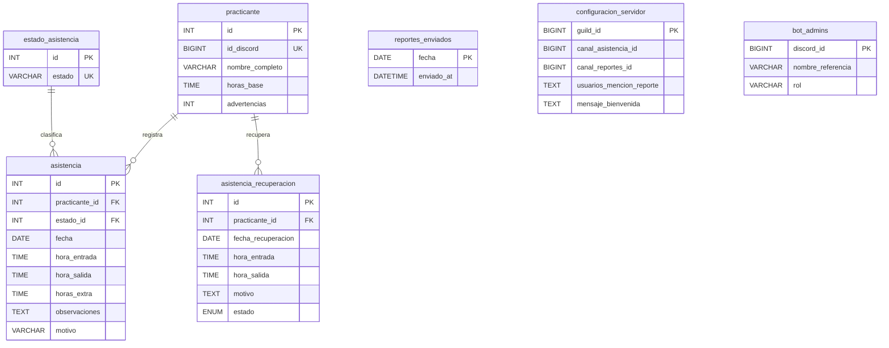
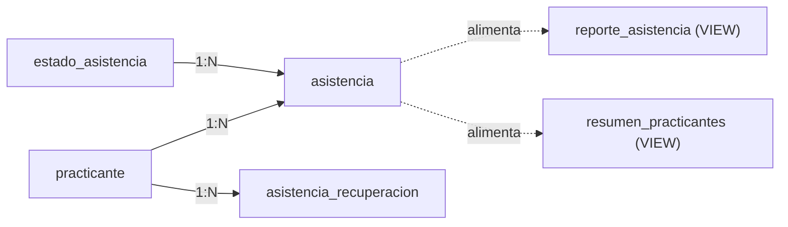

# 🗄️ Diseño de Base de Datos — Bot Asistencia RPSoft

**Motor:** MariaDB 10.6 (InnoDB) · **Charset:** `utf8mb4_unicode_ci`  
**Base de datos:** `asistencia_rp_soft`  
**Inicialización:** [database.py](file:///home/jhefry-lap/IdeaProjects/Bot-Asistencia-RPsoft/bot_asistencia_main/database.py) → `ensure_db_setup()`

---

## Diagrama Entidad-Relación

---

## Tablas

### 1. `practicante`
Tabla central del sistema. Almacena los datos de cada practicante vinculado por su cuenta de Discord.

| Columna | Tipo | Restricciones | Descripción |
|---|---|---|---|
| `id` | `INT` | PK, AUTO_INCREMENT | Identificador interno |
| `id_discord` | `BIGINT` | NOT NULL, UNIQUE | ID de usuario en Discord |
| `nombre_completo` | `VARCHAR(255)` | NOT NULL | Nombre completo del practicante |
| `horas_base` | `TIME` | DEFAULT `'00:00:00'` | Horas pre-cargadas (previas al bot, importadas de Excel) |
| `advertencias` | `INT` | DEFAULT `0` | Contador de advertencias por no cerrar recuperaciones |

---

### 2. `estado_asistencia`
Catálogo de estados posibles de asistencia. Se pre-carga con datos semilla.

| Columna | Tipo | Restricciones | Descripción |
|---|---|---|---|
| `id` | `INT` | PK, AUTO_INCREMENT | Identificador del estado |
| `estado` | `VARCHAR(50)` | NOT NULL, UNIQUE | Nombre del estado |

**Valores semilla:**

| ID | Estado |
|----|--------|
| 1 | Presente |
| 2 | Tardanza |
| 3 | Falta Injustificada |
| 4 | Falta Recuperada |
| 5 | Permiso |

---

### 3. `asistencia`
Registro principal de asistencia diaria. Cada practicante solo puede tener **un registro por día**.

| Columna | Tipo | Restricciones | Descripción |
|---|---|---|---|
| `id` | `INT` | PK, AUTO_INCREMENT | Identificador del registro |
| `practicante_id` | `INT` | FK → `practicante(id)` ON DELETE CASCADE | Practicante asociado |
| `estado_id` | `INT` | FK → `estado_asistencia(id)` | Estado de la asistencia |
| `fecha` | `DATE` | NOT NULL | Fecha del registro |
| `hora_entrada` | `TIME` | NULL | Hora de llegada |
| `hora_salida` | `TIME` | NULL | Hora de salida |
| `horas_extra` | `TIME` | DEFAULT `'00:00:00'` | Horas extra trabajadas |
| `observaciones` | `TEXT` | NULL | Notas del sistema (ej: validación Google Sheets) |
| `motivo` | `VARCHAR(255)` | NULL | Motivo de tardanza/falta |

**Índices:**
- `UNIQUE KEY unique_asistencia_dia (practicante_id, fecha)` — Un registro por practicante por día
- `KEY estado_id (estado_id)` — Índice para búsquedas por estado

---

### 4. `asistencia_recuperacion`
Registra sesiones de recuperación de horas fuera del horario regular. Un practicante solo puede tener **una sesión de recuperación por día**.

| Columna | Tipo | Restricciones | Descripción |
|---|---|---|---|
| `id` | `INT` | PK, AUTO_INCREMENT | Identificador |
| `practicante_id` | `INT` | FK → `practicante(id)` ON DELETE CASCADE | Practicante |
| `fecha_recuperacion` | `DATE` | NOT NULL | Fecha de la recuperación |
| `hora_entrada` | `TIME` | NOT NULL | Hora de inicio |
| `hora_salida` | `TIME` | NULL | Hora de cierre (NULL = sesión abierta) |
| `motivo` | `TEXT` | NULL | Razón de la recuperación |
| `estado` | `ENUM('abierto','valido','invalidado')` | DEFAULT `'abierto'` | Estado de la sesión |

> [!NOTE]
> El campo `estado` en el **código** (`database.py`) usa `ENUM('abierto','valido','invalidado')`, pero en el **respaldo SQL** fue exportado como `VARCHAR(20) DEFAULT 'Pendiente'`. Esto se debe a que el respaldo fue anterior a la migración del sistema de recuperación.

**Índice:**
- `UNIQUE KEY unique_recuperacion_dia (practicante_id, fecha_recuperacion)`

---

### 5. `reportes_enviados`
Control de idempotencia para los reportes diarios automáticos. Evita el envío duplicado al canal de Discord.

| Columna | Tipo | Restricciones | Descripción |
|---|---|---|---|
| `fecha` | `DATE` | PK | Fecha del reporte |
| `enviado_at` | `DATETIME` | DEFAULT `CURRENT_TIMESTAMP` | Timestamp de envío |

---

### 6. `configuracion_servidor`
Configuración personalizable por servidor de Discord (guild).

| Columna | Tipo | Restricciones | Descripción |
|---|---|---|---|
| `guild_id` | `BIGINT` | PK | ID del servidor Discord |
| `canal_asistencia_id` | `BIGINT` | NULL | Canal designado para asistencia |
| `canal_reportes_id` | `BIGINT` | NULL | Canal designado para reportes |
| `usuarios_mencion_reporte` | `TEXT` | NULL | IDs de Discord separados por comas |
| `mensaje_bienvenida` | `TEXT` | NULL | Mensaje de bienvenida personalizado |

---

### 7. `bot_admins`
Lista de administradores autorizados para ejecutar comandos administrativos del bot.

| Columna | Tipo | Restricciones | Descripción |
|---|---|---|---|
| `discord_id` | `BIGINT` | PK | ID de Discord del admin |
| `nombre_referencia` | `VARCHAR(255)` | NULL | Nombre de referencia |
| `rol` | `VARCHAR(100)` | DEFAULT `'Developer'` | Rol (ej: Dev Principal, Product Owner) |

---

## Vistas

### `reporte_asistencia`
Vista detallada para exportación a Google Sheets. Combina datos de `asistencia`, `practicante` y `estado_asistencia`.

| Columna | Origen | Descripción |
|---|---|---|
| `Asistencia_ID` | `asistencia.id` | ID del registro |
| `ID_Discord` | `practicante.id_discord` | ID Discord |
| `Nombre_Completo` | `practicante.nombre_completo` | Nombre |
| `Fecha` | `asistencia.fecha` | Fecha |
| `Entrada` | `asistencia.hora_entrada` | Hora entrada |
| `Salida` | `asistencia.hora_salida` | Hora salida |
| `Estado` | `estado_asistencia.estado` | Estado textual |
| `Horas_Sesion` | Calculado: `TIMEDIFF(salida, entrada)` | Duración de la sesión |
| `Horas_Base` | `practicante.horas_base` | Horas pre-cargadas |
| `Total_Horas_Bot` | Subconsulta: suma de todas las sesiones | Total registrado por el bot |
| `Gran_Total_Acumulado` | `Horas_Base + Total_Horas_Bot` | Gran total |

---

### `resumen_practicantes`
Vista resumida para consultas rápidas del estado de horas por practicante.

| Columna | Descripción |
|---|---|
| `id` | ID interno del practicante |
| `ID_Discord` | ID Discord |
| `Nombre_Completo` | Nombre |
| `Horas_Base` | Horas pre-cargadas |
| `Horas_Bot` | Total de horas registradas por el bot |
| `Total_Acumulado` | `Horas_Base + Horas_Bot` |

Ordenada por `Total_Acumulado DESC` — los practicantes con más horas aparecen primero.

---

## Relaciones y Reglas de Negocio

| Regla | Implementación |
|---|---|
| Un practicante = un registro de asistencia por día | `UNIQUE KEY (practicante_id, fecha)` |
| Un practicante = una recuperación por día | `UNIQUE KEY (practicante_id, fecha_recuperacion)` |
| Eliminar practicante → elimina sus registros | `ON DELETE CASCADE` en FKs de `asistencia` y `asistencia_recuperacion` |
| Solo un reporte diario por fecha | `reportes_enviados.fecha` es PK |
| 3 advertencias consecutivas → invalidar recuperación | `practicante.advertencias` + lógica en `scheduled_tasks.py` |

---

## Notas Técnicas

- **Conexión:** Pool asíncrono via `aiomysql` (min 1, max 10 conexiones)
- **SSL:** Configurable via `DB_USE_SSL` en `.env`
- **Autocommit:** Desactivado — las transacciones se manejan explícitamente con `commit()` / `rollback()`
- **Tipo `TIME` para horas acumuladas:** MariaDB permite valores `TIME` mayores a 24h (ej: `441:57:20`), lo cual se usa para almacenar totales de horas trabajadas
