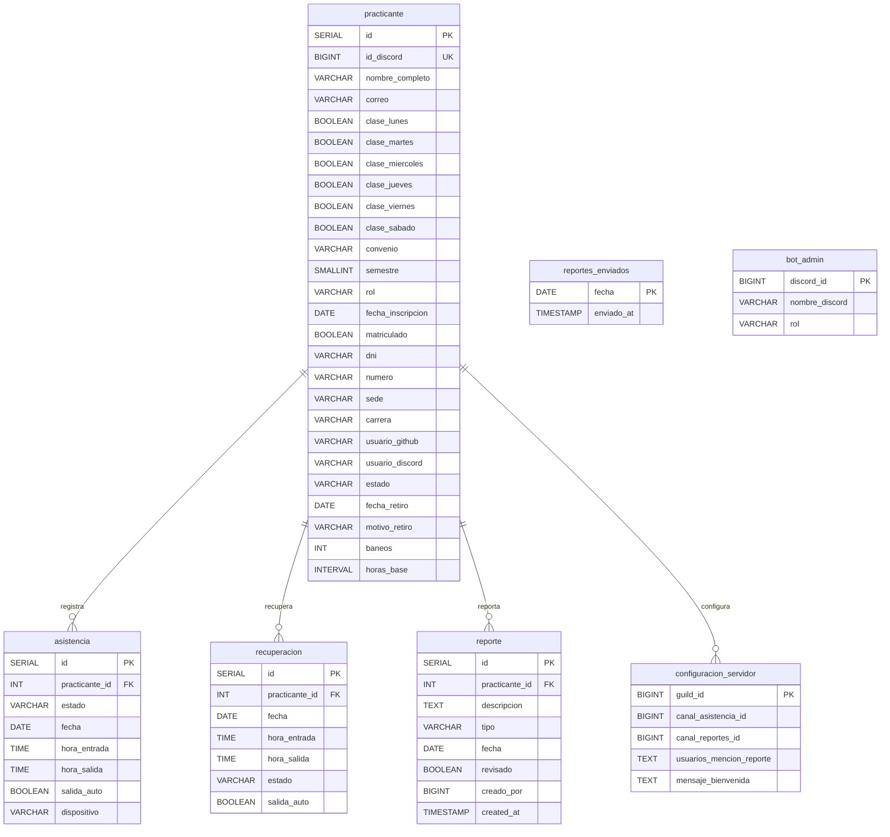

# 🗄️ Diseño de Base de Datos — Bot Asistencia RPSoft

**Motor:** PostgreSQL 16  
**Base de datos:** `${DB_NAME}` (default `asistencia_rp_soft`)  
**Inicialización:** `bot_asistencia_main/database.py` → `ensure_db_setup()` (usa `asyncpg`)

---

## Diagrama Entidad-Relación

---

## Tablas

### 1. `practicante`
Tabla central. Contiene datos de Discord y datos académicos/operativos.

| Columna | Tipo | Restricciones | Descripción |
|---|---|---|---|
| `id` | `SERIAL` | PK | Identificador interno |
| `id_discord` | `BIGINT` | NOT NULL, UNIQUE | ID de usuario en Discord |
| `nombre_completo` | `VARCHAR(255)` | NOT NULL | Nombre completo |
| `correo` | `VARCHAR(255)` | NULL | Email institucional/personal |
| `clase_lunes` … `clase_sabado` | `BOOLEAN` | DEFAULT `FALSE` | Días de clase |
| `convenio` | `VARCHAR(20)` | DEFAULT `'no'` | Tipo de convenio |
| `semestre` | `SMALLINT` | NULL | Semestre académico |
| `rol` | `VARCHAR(50)` | NULL | Rol interno |
| `fecha_inscripcion` | `DATE` | DEFAULT `CURRENT_DATE` | Fecha alta |
| `matriculado` | `BOOLEAN` | DEFAULT `FALSE` | Estado de matrícula |
| `dni` | `VARCHAR(15)` | NULL | Documento |
| `numero` | `VARCHAR(20)` | NULL | Teléfono |
| `sede` | `VARCHAR(100)` | NULL | Sede |
| `carrera` | `VARCHAR(150)` | NULL | Carrera |
| `usuario_github` | `VARCHAR(100)` | NULL | Usuario GitHub |
| `usuario_discord` | `VARCHAR(100)` | NULL | Username Discord |
| `estado` | `VARCHAR(20)` | DEFAULT `'activo'` | Estado operativo |
| `fecha_retiro` | `DATE` | NULL | Fecha de retiro |
| `motivo_retiro` | `VARCHAR(255)` | NULL | Motivo retiro |
| `baneos` | `INT` | DEFAULT `0` | Conteo de baneos |
| `horas_base` | `INTERVAL` | DEFAULT `'0 hours'` | Horas precargadas |

---

### 2. `asistencia`
Registro diario. Solo un registro por practicante y fecha.

| Columna | Tipo | Restricciones | Descripción |
|---|---|---|---|
| `id` | `SERIAL` | PK | Identificador |
| `practicante_id` | `INT` | FK → `practicante(id)` ON DELETE CASCADE | Practicante |
| `estado` | `VARCHAR(20)` | NOT NULL | Estado textual (Presente, Tardanza, etc.) |
| `fecha` | `DATE` | NOT NULL | Día de la asistencia |
| `hora_entrada` | `TIME` | NULL | Entrada |
| `hora_salida` | `TIME` | NULL | Salida |
| `salida_auto` | `BOOLEAN` | DEFAULT `FALSE` | Si el cierre fue automático |
| `dispositivo` | `VARCHAR(10)` | NULL | Origen (web, bot, etc.) |

**Índices y reglas:**
- `UNIQUE (practicante_id, fecha)` garantiza un registro diario.
- Índices en `fecha` y `estado` para consultas rápidas.

---

### 3. `recuperacion`
Sesiones de recuperación de horas. Una por practicante y fecha.

| Columna | Tipo | Restricciones | Descripción |
|---|---|---|---|
| `id` | `SERIAL` | PK | Identificador |
| `practicante_id` | `INT` | FK → `practicante(id)` ON DELETE CASCADE | Practicante |
| `fecha` | `DATE` | NOT NULL | Día de recuperación |
| `hora_entrada` | `TIME` | NOT NULL | Inicio |
| `hora_salida` | `TIME` | NULL | Fin (NULL = abierta) |
| `estado` | `VARCHAR(15)` | DEFAULT `'abierto'` | `abierto`, `valido`, `invalidado` |
| `salida_auto` | `BOOLEAN` | DEFAULT `FALSE` | Cierre automático |

**Regla:** `UNIQUE (practicante_id, fecha)` evita recuperaciones duplicadas.

---

### 4. `reporte`
Tabla unificada para distintos tipos de reportes (faltas, incidencias, etc.).

| Columna | Tipo | Restricciones | Descripción |
|---|---|---|---|
| `id` | `SERIAL` | PK | Identificador |
| `practicante_id` | `INT` | FK → `practicante(id)` ON DELETE CASCADE | Practicante |
| `descripcion` | `TEXT` | NOT NULL | Detalle del reporte |
| `tipo` | `VARCHAR(30)` | NOT NULL | Tipo (ej. `falta`, `retraso`, `observacion`) |
| `fecha` | `DATE` | DEFAULT `CURRENT_DATE` | Fecha del evento |
| `revisado` | `BOOLEAN` | DEFAULT `FALSE` | Estado de revisión |
| `creado_por` | `BIGINT` | NULL | ID Discord de quien reporta |
| `created_at` | `TIMESTAMP` | DEFAULT `NOW()` | Creado en |

**Índices:** `practicante_id`, `fecha`, `tipo` para filtrado.

---

### 5. `reportes_enviados`
Control de idempotencia para envíos automáticos al canal de reportes.

| Columna | Tipo | Restricciones | Descripción |
|---|---|---|---|
| `fecha` | `DATE` | PK | Fecha del reporte |
| `enviado_at` | `TIMESTAMP` | DEFAULT `NOW()` | Momento de envío |

---

### 6. `configuracion_servidor`
Preferencias por guild de Discord.

| Columna | Tipo | Restricciones | Descripción |
|---|---|---|---|
| `guild_id` | `BIGINT` | PK | ID del servidor |
| `canal_asistencia_id` | `BIGINT` | NULL | Canal para comandos de asistencia |
| `canal_reportes_id` | `BIGINT` | NULL | Canal para reportes diarios |
| `usuarios_mencion_reporte` | `TEXT` | NULL | IDs (coma separada) a mencionar |
| `mensaje_bienvenida` | `TEXT` | NULL | Mensaje personalizado |

---

### 7. `bot_admin`
Lista de administradores permitidos para comandos administrativos.

| Columna | Tipo | Restricciones | Descripción |
|---|---|---|---|
| `discord_id` | `BIGINT` | PK | ID de Discord |
| `nombre_discord` | `VARCHAR(255)` | NULL | Nombre de referencia |
| `rol` | `VARCHAR(100)` | DEFAULT `'Developer'` | Rol (Dev, PO, etc.) |

---

## Reglas de Negocio

| Regla | Implementación |
|---|---|
| Un practicante = un registro de asistencia por día | `UNIQUE (practicante_id, fecha)` en `asistencia` |
| Un practicante = una recuperación por día | `UNIQUE (practicante_id, fecha)` en `recuperacion` |
| Al eliminar practicante se elimina su historial | FKs `ON DELETE CASCADE` |
| Reporte diario de idempotencia | `reportes_enviados.fecha` es PK |

---

## Notas Técnicas

- Conexión: pool asíncrono `asyncpg` (min 1, max 10). `init_db_pool()` en `database.py`.
- Puerto: `DB_PORT=5432` por defecto en Docker (`db` service).
- `horas_base` usa `INTERVAL`, útil para horas acumuladas mayores a 24h.
- `ensure_db_setup()` crea tablas e inserta admins iniciales (`bot_admin`).

**Última actualización:** 2026-03-14
